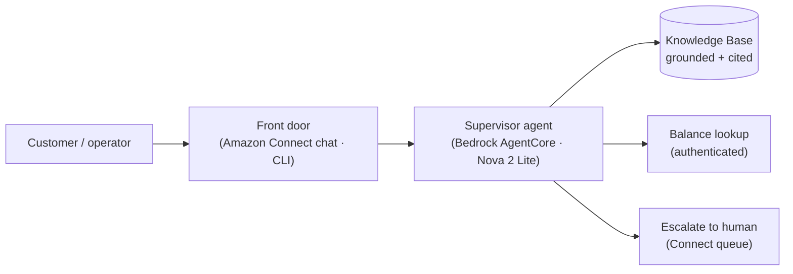
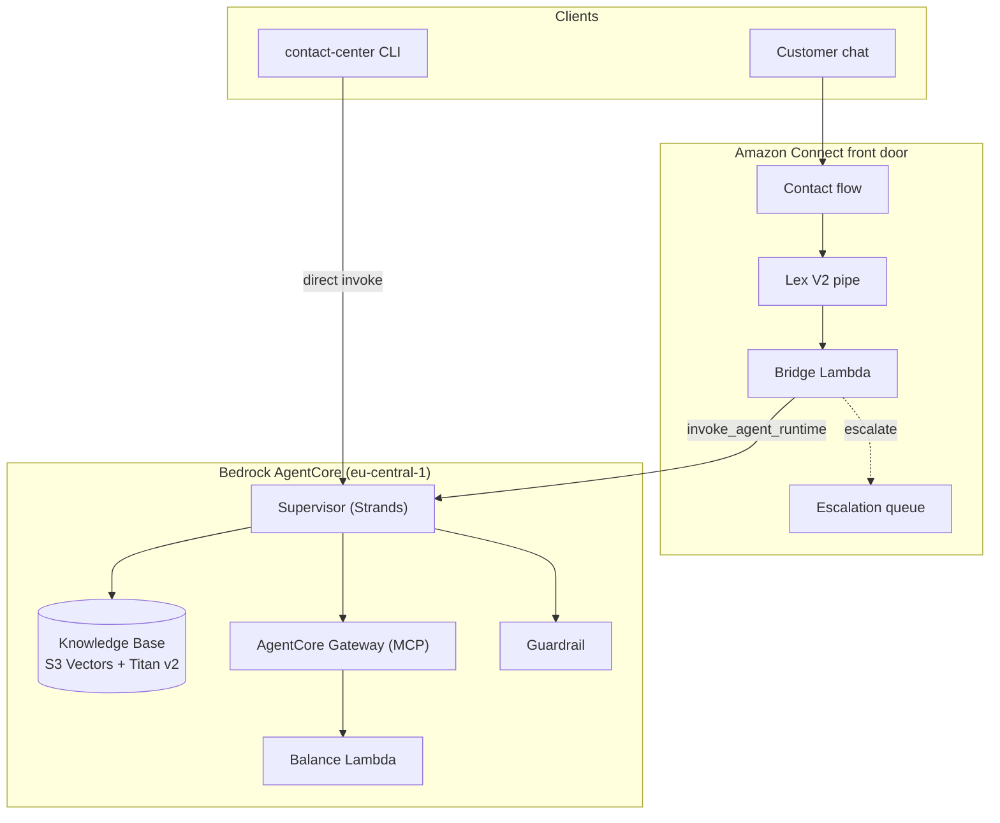

# contact-center

[](https://github.com/deadhand777/contact-center/actions?query=workflow%3Aci)
[](https://deadhand777.github.io/contact-center/)
[](https://www.python.org/)
[](https://github.com/astral-sh/uv)
[](https://github.com/astral-sh/ruff)
[](https://github.com/astral-sh/ty)
[](https://github.com/pawamoy/duty)
[](https://docs.pytest.org/)
[](https://aws.amazon.com/)

An **agentic contact-center proof of concept** for a regulated German bank. It turns human-heavy chat handling into an autonomous assistant
that answers product questions with citations, looks up authenticated account
balances, and escalates cleanly to a human — all inside EU data residency
(`eu-central-1`) under BaFin/DORA constraints.



## What it does

- **Grounded knowledge Q&A** — product/fee/condition answers retrieved from a
  curated corpus, always with a `[Quelle: …]` citation.
- **Authenticated balance lookup** — the customer identity is bound server-side
  (never chosen by the LLM); balances render in German format (`2.543,17 EUR`).
- **Deterministic escalation** — a strict `{answer, escalate, reason}` contract;
  `escalate=true` maps to a real Amazon Connect queue transfer, with fixed
  German routing tokens.
- **Compliance guardrail** — PII anonymization + investment-advice denial.
- **Deterministic eval + observability** — `contact-center eval` scores a golden
  set (14/14 passing); bridge and agent emit PII-safe, `session_id`-keyed logs.

## Architecture at a glance



Full detail — components, request flow, KB ingestion, security model — is in the
[Architecture](docs/architecture.md) docs.

## Repository layout

| Path | Contents |
|------|----------|
| `src/contact_center/` | CLI harness — `chat` (direct / `--connect`) and `eval` |
| `contactcenter/` | AgentCore project; supervisor + specialists in `app/knowledge_agent/` |
| `infra/` | Hand-written CDK: `KnowledgeStack`, `ConnectStack`, Lambdas, contact flow |
| `docs/corpus/` | Synthetic German bank documents ingested by the Knowledge Base |
| `docs/eval/` | Golden question set for the eval harness |
| `docs/` | Documentation site (zensical) |
| `config/` | Tool configs (`ruff.toml`, `ty.toml`, `pytest.ini`, …) |

Read the deeper docs: [Use Case](docs/use-case.md) ·
[Architecture](docs/architecture.md) · [Functionality](docs/functionality.md) ·
[Tech Stack](docs/tech-stack.md). Component READMEs live in `infra/`,
`contactcenter/`, and `contactcenter/app/knowledge_agent/`.

## Development

Set up the environment with [`uv`](https://docs.astral.sh/uv/):

```bash
git clone https://github.com/deadhand777/contact-center
cd contact-center
make setup            # create venv + install deps
make test             # offline test suite
make check            # ruff + ty + docs
make docs             # serve docs at localhost:8000
```

Tasks run via `duty` through `scripts/make` (or `make` with `direnv allow`).

## Quickstart (deploy)

Prereqs: Node 20+, uv, AWS credentials for the sandbox account (`eu-central-1`),
`npm install -g @aws/agentcore`.

1. `make setup` — Python env
2. `cd infra && npm install && npx cdk deploy` — knowledge base, guardrail, gateway, balance Lambda, IAM
3. `cd infra && npx cdk deploy ContactCenterConnect` — Connect instance, Lex pipe bot, escalation queue, bridge Lambda
4. Start the KB ingestion job
5. `cd contactcenter && agentcore deploy -y` — deploy the supervisor agent on AgentCore Runtime.
   Run this from `contactcenter/` (the scaffold root; its config is at `contactcenter/agentcore/agentcore.json`).
   After the first gateway deploy, publish its MCP URL to SSM `/contact-center/gateway-url` (from the deploy output).
6. `aws ssm put-parameter --name /contact-center/runtime-arn ...` — publish the runtime ARN
7. Attach the least-privilege policy (ARN at `/contact-center/agent-policy-arn`) to the runtime execution role:
   `aws iam attach-role-policy --role-name <runtime-execution-role> --policy-arn $(aws ssm get-parameter --name /contact-center/agent-policy-arn --query Parameter.Value --output text)`

## Using it

```bash
contact-center chat -q "Was kostet das Girokonto?"    # direct invoke (--customer default KND-1001)
contact-center chat --connect --customer KND-1001      # through the Amazon Connect front door
RUN_EVAL=1 contact-center eval                          # score the golden set (14 items)
```

Escalations display as `⚠ Übergabe an Mitarbeiter: <reason>` (direct) or land in
the "escalations" Connect queue (`--connect`).

## Tests

- Offline suite: `make test` (ruff/ty/docs via `make check`).
- Live integration (double-gated): `AWS_PROFILE=<profile> RUN_INTEGRATION=1 uv run pytest -c config/pytest.ini -o addopts= -m integration --no-cov tests/test_integration.py` (and `tests/test_connect_integration.py`).
- Live eval (gated): `AWS_PROFILE=<profile> RUN_EVAL=1 uv run contact-center eval`.
- CDK templates: `cd infra && npm test`.


## Support

- 📖 **Documentation**: <https://deadhand777.github.io/contact-center>
- 🐛 **Issues**: [GitHub Issues](https://github.com/deadhand777/contact-center/issues)
- 💬 **Discussions**: [GitHub Discussions](https://github.com/deadhand777/contact-center/discussions)


---

**Made with ❤️ by [@deadhand777](https://github.com/deadhand777)**
