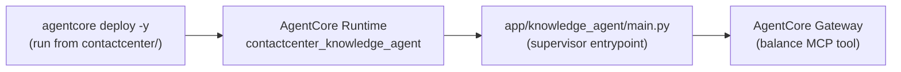

# AgentCore Project — contact-center supervisor

The [AgentCore CLI](https://github.com/aws/agentcore-cli) project that packages
and deploys the **contact-center supervisor agent** to Amazon Bedrock AgentCore
Runtime (`eu-central-1`). The agent itself lives in
[`app/knowledge_agent/`](app/knowledge_agent/) — a Strands supervisor with a
knowledge specialist (RAG) and a banking specialist (balance via the AgentCore
Gateway), returning the `{answer, escalate, reason}` contract.

**Deploy:** `cd contactcenter && agentcore deploy -y` — it reads
`agentcore/agentcore.json` (one level down). See the repository `README.md`
quickstart and the [Architecture](../docs/architecture.md) docs for how this
fits the whole system.

The generic AgentCore scaffold reference — project structure, mental model,
CLI commands, resource model — lives in [`../AGENTS.md`](../AGENTS.md).

## Documentation

- [AgentCore CLI](https://github.com/aws/agentcore-cli)
- [AgentCore CDK Constructs](https://github.com/aws/agentcore-l3-cdk-constructs)
- [Amazon Bedrock AgentCore](https://aws.amazon.com/bedrock/agentcore/)
