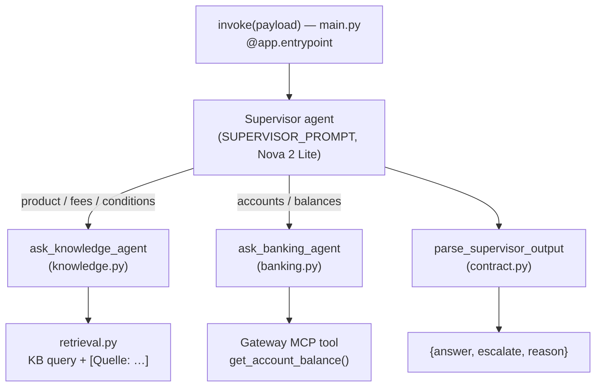

# knowledge_agent — the supervisor agent

The deployed Bedrock AgentCore agent. A **Strands supervisor** coordinates two
specialists using the *agents-as-tools* pattern, and returns a strict response
contract. The model is **Amazon Nova 2 Lite** (`eu.amazon.nova-2-lite-v1:0`).

> Scaffolded by the AgentCore CLI; `main.py` is the `@app.entrypoint`. Deploy
> with `agentcore deploy` from the `contactcenter/` project root.



## Files

| File | Responsibility |
|------|----------------|
| `main.py` | `@app.entrypoint invoke(payload, context)`: sets customer identity, runs the supervisor, parses the contract, logs a PII-safe record |
| `knowledge.py` | `ask_knowledge_agent` — retrieval-augmented product/fee/condition answers |
| `banking.py` | `ask_banking_agent` + the no-arg `get_account_balance()` tool; identity via `ContextVar` |
| `retrieval.py` | Knowledge Base query; emits `[Quelle: <source>]` citation markers (code, not prompt) |
| `contract.py` | `parse_supervisor_output` → `{answer, escalate, reason}`; `escalation_log_record` (PII-safe log) |
| `shared.py` | Model + config (fail-closed SSM reads) |

## Contracts (do not casually change)

- **Response contract:** `{"answer": str, "escalate": bool, "reason": str | None}`.
- **Escalation `reason` routing tokens** (German, consumed by the Connect flow):
  `Kundenwunsch`, `Sensibles Thema Kreditablehnung`, `Systemfehler Kontodienst`,
  `Kunde nicht identifiziert`, `Keine gesicherte Antwort möglich`.
- **German number format** (`4,90`, `2.543,17`) and **`[Quelle: …]`** citations
  are asserted by golden/integration tests.
- Prompts are deliberately **German**; keep them so.

## Security

The balance tool takes **no arguments** — the authenticated `customer_id` is
bound to a `ContextVar` per invocation and read server-side, so the LLM can
never request another customer's data (IDOR closed). SSM config reads are
**fail-closed**.

## Testing

Pure logic (`contract.py`, `retrieval.py`) is unit-tested from the repo
`tests/` by **file path** (the agent's own venv holds `strands` /
`bedrock_agentcore`, which the offline suite doesn't import). `contactcenter/`
is outside `ruff`/`ty` scope by design.

## Deploy

```bash
cd contactcenter
agentcore deploy -y      # packages app/ and deploys to AgentCore Runtime
agentcore invoke '{"prompt": "Was kostet das Girokonto?"}'
```
