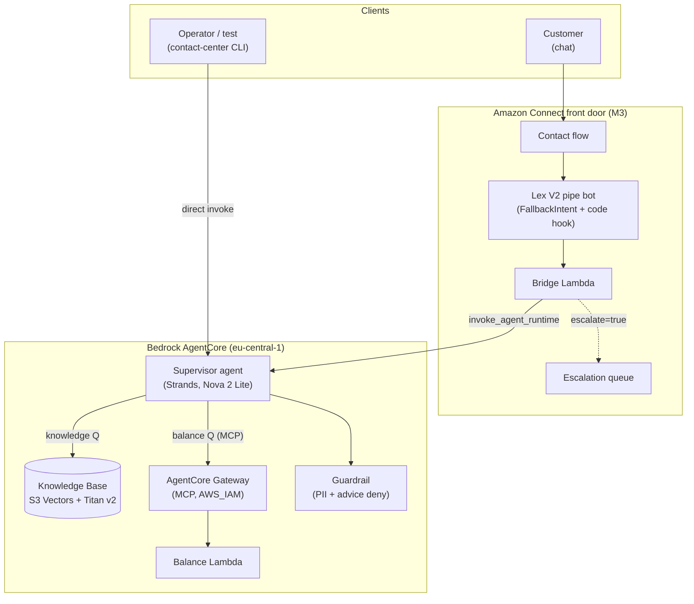
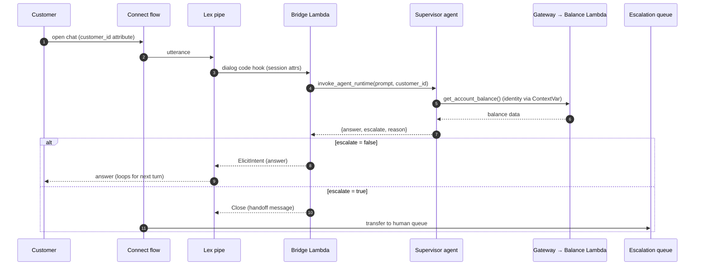
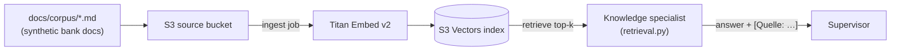
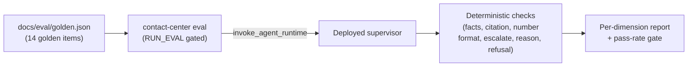

# Architecture

This page describes the end-to-end architecture of the contact-center PoC: the
runtime components, how a request flows through them, how the knowledge base is
built, and how escalation and observability work.

All infrastructure runs in **AWS `eu-central-1`** (EU data residency) in a single
sandbox account. Nothing leaves the region.

## System context

Two front doors reach the same brain. A developer/operator drives the agent
directly through the CLI harness; a customer reaches it through Amazon Connect
chat. Both end at the **supervisor agent** on Bedrock AgentCore Runtime, which
is grounded by a Knowledge Base and can look up balances through an AgentCore
Gateway.

## Components

| Component | Where | Responsibility |
|-----------|-------|----------------|
| **CLI harness** | `src/contact_center/` | `chat` (direct or `--connect`) and `eval` subcommands; talks to the runtime and Connect via boto3 |
| **Supervisor agent** | `contactcenter/app/knowledge_agent/main.py` | Routes each turn to a specialist, enforces the response contract, decides escalation |
| **Knowledge specialist** | `knowledge.py` + `retrieval.py` | Retrieval-augmented answers from the Knowledge Base; emits `[Quelle: …]` citations |
| **Banking specialist** | `banking.py` | Balance lookups via the Gateway MCP tool; identity from a `ContextVar`, never the LLM |
| **Response contract** | `contract.py` | Parses supervisor output into `{answer, escalate, reason}` |
| **Knowledge Base** | `infra/lib/knowledge-stack.ts` | Bedrock KB over `docs/corpus/`, S3 Vectors storage, Titan Embed v2 |
| **Guardrail** | `knowledge-stack.ts` | PII anonymization + investment-advice denial (BaFin) |
| **Balance Lambda** | `infra/lambda/balance/` | Synthetic account data behind the Gateway |
| **Connect + Lex + bridge** | `infra/lib/connect-stack.ts`, `infra/lambda/bridge/` | Chat front door; Lex as a dumb pipe; bridge forwards turns to the runtime |
| **Eval harness** | `src/contact_center/_internal/eval_runner.py` | Deterministic scoring of a golden set against the deployed agent |

## Request flow — a chat turn through Connect

The customer's identity (`customer_id`) is attached to the contact at
`StartChatContact` as a contact attribute, carried through Lex session
attributes into the bridge, and forwarded to the agent. The LLM never chooses
whose balance to read.

The `escalate` flag is a **routing contract**. When true, the contact flow
transfers to the escalation queue; the `reason` is one of a fixed set of German
routing tokens (see [Functionality](functionality.md#escalation)).

## Knowledge base ingestion

The Knowledge Base is built once by CDK from the synthetic German bank corpus
in `docs/corpus/`. Documents are chunked, embedded with Titan Embed v2, and
stored in S3 Vectors. At query time the knowledge specialist retrieves the
top chunks and grounds its answer, appending `[Quelle: <file>]` citations.

## Security & identity model

- **No LLM-controlled identity.** The balance tool takes no arguments; the
  authenticated `customer_id` is bound to a `ContextVar` per invocation and read
  server-side. This closes the IDOR class where a prompt could ask for another
  customer's balance.
- **Guardrail at the model boundary.** PII is anonymized; investment-advice
  requests are denied (regulatory: no unlicensed advice).
- **Fail-closed config.** Missing required SSM parameters raise rather than
  silently dropping a guardrail or gateway.
- **Gateway auth.** The Gateway uses AWS_IAM (SigV4); the agent's role is
  narrowly scoped.
- **PII-safe logs.** Bridge and agent emit structured logs keyed by
  `session_id` with **no answer text** and only synthetic `customer_id`.

## Evaluation & observability (M4)

Every turn through the bridge and agent emits a structured log line keyed by the
`connect-<contactId>` session id (no answer text), so one conversation can be
reconstructed across CloudWatch log groups. AgentCore's built-in GenAI traces
cover the model layer.

## Milestone map

| Milestone | Adds |
|-----------|------|
| **M1** | Knowledge agent (RAG) on AgentCore + KB + Guardrail + CLI `chat` |
| **M2** | Balance tool via Gateway + supervisor + structured escalation |
| **M3** | Amazon Connect chat front door via a Lex pipe + bridge Lambda |
| **M4** | Eval harness (`contact-center eval`) + PII-safe correlation logging |
