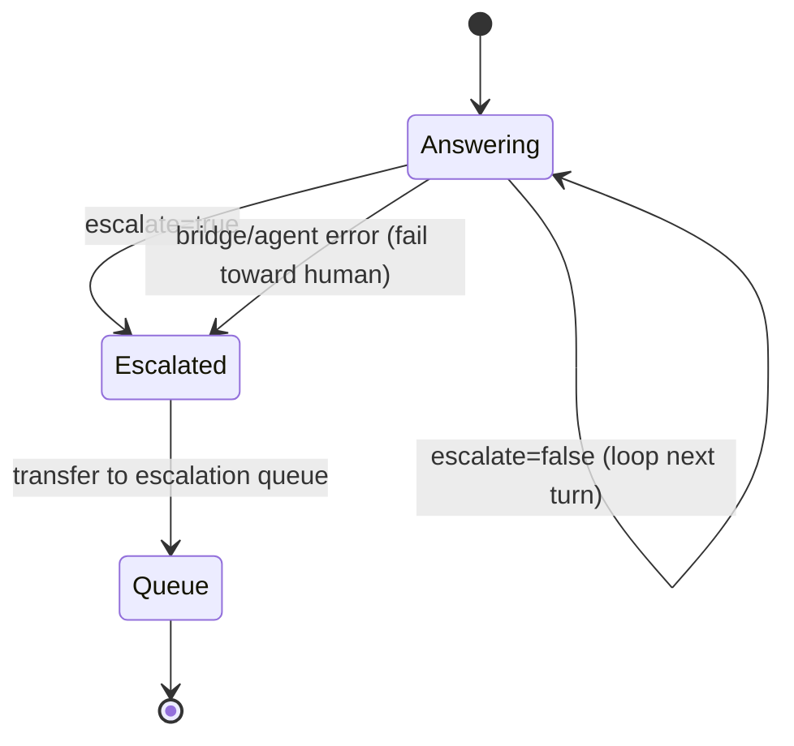

# Functionality

Each feature below rests on a contract that can be checked from the outside:
a response shape, a fixed set of routing tokens, a citation marker, a scored
golden set.

## The response contract

Every agent turn returns exactly:

```json
{"answer": "…text for the customer…", "escalate": false, "reason": null}
```

- `answer`: the German (or English, if asked in English) reply.
- `escalate`: boolean routing signal.
- `reason`: `null` when not escalating, otherwise one of the fixed routing
  tokens below.

`contract.py` parses the supervisor's output into this shape via
`SupervisorResponse.from_supervisor_output`. Validation is strict: a response is
rejected unless all of the following hold.

| Rule | Rejected example |
|------|------------------|
| the field set is exactly `{answer, escalate, reason}` | an extra `confidence` field; a missing `reason` |
| `escalate` is a real `bool` | `0`, `1`, `"false"` |
| `answer` is a non-empty, non-whitespace string | `""`, `"   "` |
| `reason` is `null` when `escalate` is `false` | `{"escalate": false, "reason": "Kundenwunsch"}` |
| `reason` is one of the tokens below when `escalate` is `true` | `{"escalate": true, "reason": "weiß nicht"}` |

Malformed output never reaches the customer as raw text. It becomes a human
escalation carrying a fixed German fallback answer and
`reason="Keine gesicherte Antwort möglich"`. The bridge Lambda repeats the same
validation on the response it gets back from the runtime, so an invalid payload
is caught even if the agent never ran.

The instance is frozen and has two projections. `to_payload()` is what the
customer-facing caller receives. `to_log_record()` is the PII-safe log view and
omits `answer` entirely.

## Knowledge Q&A (grounded + cited)

The knowledge specialist answers product/fee/condition questions by retrieving
from the Knowledge Base and grounding its answer in the retrieved chunks. Every
knowledge answer carries a citation marker `[Quelle: <source>]`, emitted by
`retrieval.py` (code, not prompt), so answers are traceable to a document.

Example (German number format is a contract):

> "Das Girokonto Komfort kostet **4,90 €** pro Monat. [Quelle: girokonto-gebuehren.md]"

## Balance lookup (authenticated)

The banking specialist calls a no-argument `get_account_balance()` tool exposed
through the AgentCore Gateway as an MCP tool. The customer identity comes from a
`ContextVar` set at invocation from the authenticated `customer_id`, which the
LLM can neither supply nor change.

Synthetic customers (in `infra/lambda/balance/handler.py`):

| Customer | Accounts |
|----------|----------|
| `KND-1001` | Girokonto `2.543,17` + Tagesgeld `15.000,00` |
| `KND-1002` | negative balance `-127,45` |
| `KND-1003` | single account `890,00` |
| anything else | `UNKNOWN_CUSTOMER` → escalation |

## Escalation

Escalation is a deterministic event. When the supervisor sets `escalate=true`,
it also emits a `reason` that is one of these routing tokens (German literals,
consumed by the Connect flow):

| `reason` | When |
|----------|------|
| `Kundenwunsch` | Customer explicitly asks for a human |
| `Sensibles Thema Kreditablehnung` | Credit-rejection detail beyond documented reasons |
| `Systemfehler Kontodienst` | Balance backend unavailable |
| `Kunde nicht identifiziert` | Unknown / unauthenticated customer |
| `Keine gesicherte Antwort möglich` | No specialist can answer |

Through Amazon Connect, `escalate=true` transfers the contact to the escalation
queue. The bridge Lambda also fails toward a human on any error, using
`Systemfehler`.



## Compliance guardrail

A Bedrock Guardrail sits at the model boundary. It anonymizes PII on inputs and
outputs, and it denies investment advice: a question like "Which stocks should I
buy?" is refused with "… aus Compliance-Gründen …" rather than answered.

When the guardrail intervenes it replaces the model's turn with its own German
blocked message, which is plain text and cannot satisfy the JSON contract. The
supervisor detects this through the model's stop reason
(`guardrail_intervened` / `content_filtered`) and passes that message to the
customer as a normal, non-escalating answer. The refusal is the intended product
behavior, so the supervisor treats it as a valid answer rather than a contract
violation and never turns it into a handoff.

## Channels & the CLI harness

The `contact-center` CLI is the operator/test front end:

```bash
contact-center chat -q "Was kostet das Girokonto?"          # direct invoke
contact-center chat --connect --customer KND-1001            # through Amazon Connect
contact-center eval                                          # score the golden set (RUN_EVAL gated)
```

- `chat` (direct) calls `invoke_agent_runtime` straight to the deployed agent.
- `chat --connect` drives a real Amazon Connect chat contact (Participant API
  plus websocket), exercising the full front door.
- `eval` runs the golden set and prints a scored report (see below).

## Evaluation harness

`contact-center eval` scores a golden question set (`docs/eval/golden.json`)
against the deployed agent. The checks are deterministic, with no LLM judge, so
results are stable and CI-gateable.

| Check | Verifies |
|-------|----------|
| `expected_facts` | required fact substrings present |
| `citation` | `[Quelle: …]` present when required |
| `number_format` | German decimal format, not US |
| `escalate_flag` | escalation matches expectation |
| `reason_token` | correct routing token |
| `refusal` | guardrail refuses advice without giving it |

It prints a per-dimension pass-rate report and exits non-zero below
`--threshold` (default `1.0`). It is gated by `RUN_EVAL=1` so it never runs in
`make check` or the default test suite. The 14-item golden set passes 14/14
against the deployed agent (measured 2026-09-11).

## Observability

A rejected response also logs a `contract_rejected` record. It names the
validation rule that rejected the response and the field names it carried, never
the answer text, so a failing eval item can be diagnosed from CloudWatch.

The bridge Lambda and the agent entrypoint each emit a structured, PII-safe log
record per turn, `{session_id, customer_id, escalate, reason, …}` with no answer
text, keyed by the `connect-<contactId>` session id. Filter either CloudWatch log
group by `session_id` to reconstruct one conversation across the pipe.
