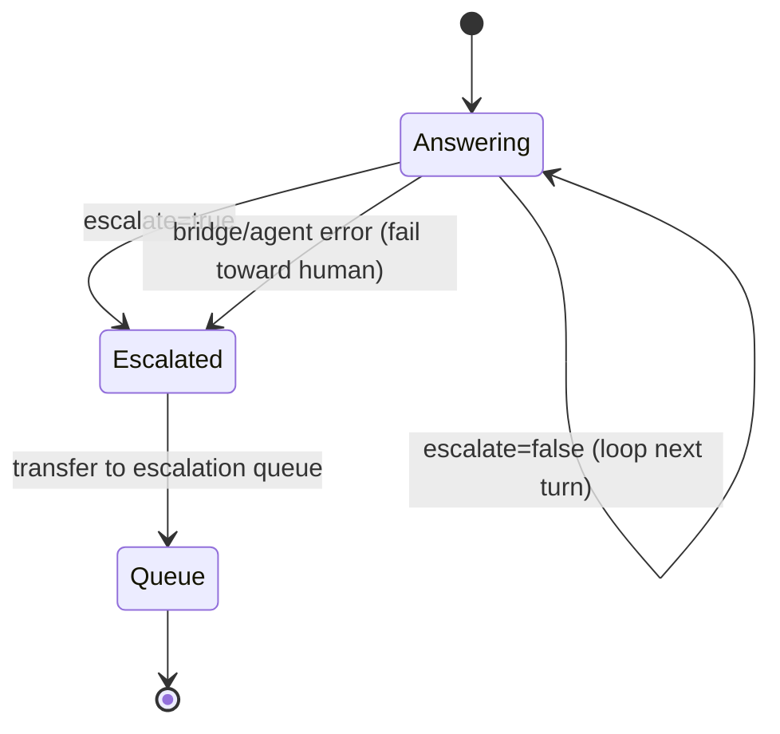

# Functionality

What the system does, feature by feature, and the contracts that make each
behavior auditable.

## The response contract

Every agent turn returns exactly:

```json
{"answer": "…text for the customer…", "escalate": false, "reason": null}
```

- `answer` — the German (or English, if asked in English) reply.
- `escalate` — boolean routing signal.
- `reason` — `null` when not escalating, otherwise one of the fixed routing
  tokens below.

`contract.py` parses the supervisor's output into this shape and falls back
safely (`escalate=false`) if the model ever returns non-contract text.

## Knowledge Q&A (grounded + cited)

The knowledge specialist answers product/fee/condition questions by retrieving
from the Knowledge Base and grounding its answer in the retrieved chunks. Every
knowledge answer carries a citation marker `[Quelle: <source>]`, emitted by
`retrieval.py` (code, not prompt), so answers are traceable to a document.

Example (German number format is a contract):

> "Das Girokonto Komfort kostet **4,90 €** pro Monat. [Quelle: girokonto-gebuehren.md]"

## Balance lookup (authenticated)

The banking specialist calls a no-argument `get_account_balance()` tool exposed
through the AgentCore Gateway as an MCP tool. The customer identity comes from a
`ContextVar` set at invocation from the authenticated `customer_id` — the LLM
cannot supply or change it.

Synthetic customers (in `infra/lambda/balance/handler.py`):

| Customer | Accounts |
|----------|----------|
| `KND-1001` | Girokonto `2.543,17` + Tagesgeld `15.000,00` |
| `KND-1002` | negative balance `-127,45` |
| `KND-1003` | single account `890,00` |
| anything else | `UNKNOWN_CUSTOMER` → escalation |

## Escalation

Escalation is a deterministic event, not a vibe. When the supervisor sets
`escalate=true`, it also emits a `reason` that is one of these **routing
tokens** (German literals, consumed by the Connect flow):

| `reason` | When |
|----------|------|
| `Kundenwunsch` | Customer explicitly asks for a human |
| `Sensibles Thema Kreditablehnung` | Credit-rejection detail beyond documented reasons |
| `Systemfehler Kontodienst` | Balance backend unavailable |
| `Kunde nicht identifiziert` | Unknown / unauthenticated customer |
| `Keine gesicherte Antwort möglich` | No specialist can answer |

Through Amazon Connect, `escalate=true` maps to a **transfer to the escalation
queue**; the bridge Lambda also fails toward a human on any error (using
`Systemfehler`).



## Compliance guardrail

A Bedrock Guardrail sits at the model boundary:

- **PII anonymization** on inputs/outputs.
- **Investment-advice denial** — questions like "Which stocks should I buy?" are
  refused ("… aus Compliance-Gründen …"), never answered with advice.

## Channels & the CLI harness

The `contact-center` CLI is the operator/test front end:

```bash
contact-center chat -q "Was kostet das Girokonto?"          # direct invoke
contact-center chat --connect --customer KND-1001            # through Amazon Connect
contact-center eval                                          # score the golden set (RUN_EVAL gated)
```

- `chat` (direct) → `invoke_agent_runtime` straight to the deployed agent.
- `chat --connect` → drives a real Amazon Connect chat contact (Participant API
  + websocket), exercising the full front door.
- `eval` → runs the golden set and prints a scored report (see below).

## Evaluation harness

`contact-center eval` scores a golden question set (`docs/eval/golden.json`)
against the **deployed** agent using **deterministic** checks — no LLM judge, so
results are stable and CI-gateable:

| Check | Verifies |
|-------|----------|
| `expected_facts` | required fact substrings present |
| `citation` | `[Quelle: …]` present when required |
| `number_format` | German decimal format, not US |
| `escalate_flag` | escalation matches expectation |
| `reason_token` | correct routing token |
| `refusal` | guardrail refuses advice without giving it |

It prints a per-dimension pass-rate report and exits non-zero below
`--threshold` (default `1.0`). It is gated by `RUN_EVAL=1` so it never runs in
`make check` or the default test suite. The current 14-item golden set passes
**14/14**.

## Observability

The bridge Lambda and the agent entrypoint each emit a structured, PII-safe log
record per turn — `{session_id, customer_id, escalate, reason, …}`, **no answer
text** — keyed by the `connect-<contactId>` session id. Filter either CloudWatch
log group by `session_id` to reconstruct one conversation across the pipe.
