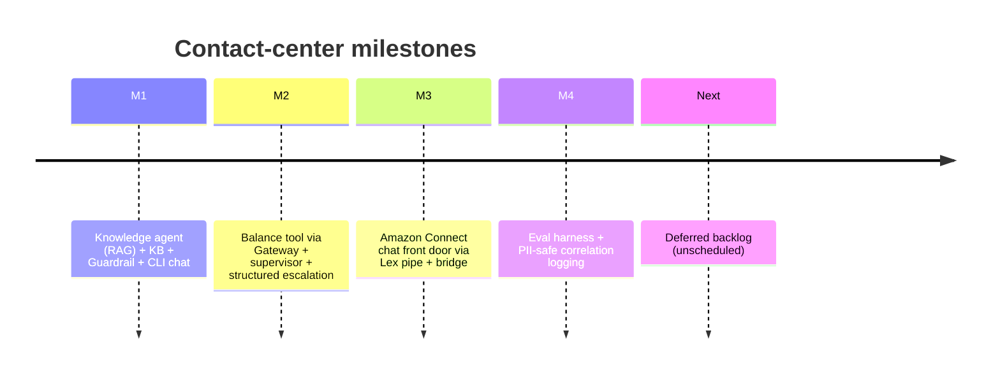
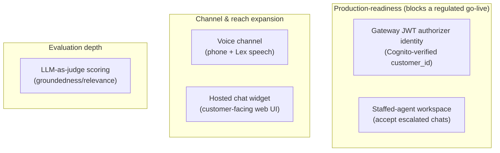

# Roadmap & Outlook

Milestones **M1–M4 are complete, merged, and live** on the sandbox. This page
records what is done and the deferred backlog — the candidate next steps, none
yet scheduled.

## Done

| Milestone | Delivered |
|-----------|-----------|
| **M1** | Strands knowledge agent on Bedrock AgentCore, grounded by a Bedrock Knowledge Base; Guardrail; `contact-center chat` |
| **M2** | Balance lookup via AgentCore Gateway (MCP); supervisor + specialists; `{answer, escalate, reason}` contract; IDOR-safe identity |
| **M3** | Amazon Connect chat front door (Lex V2 as a dumb pipe + bridge Lambda); escalation → real queue transfer |
| **M4** | Deterministic eval harness (`contact-center eval`, 14/14) + PII-safe, `session_id`-keyed structured logging |

## Known regulatory and security limitations

This is a PoC on a sandbox account. Before any regulated go-live, the following
gaps are open and must be closed — several are the reason the backlog items
below exist.

- **Client-asserted customer identity (highest risk).** `customer_id` arrives as
  an Amazon Connect contact attribute, not a cryptographically verified token
  claim. The balance tool is IDOR-safe *server-side* (identity is read from a
  `ContextVar`, so the LLM cannot forge or override it), but the identity fed
  into that binding is *trusted, not proven*. Anyone able to set the contact
  attribute could query another customer's data. Closed by the **Gateway JWT
  authorizer identity** item below.
- **No staffed escalation endpoint.** Escalations transfer to a real Connect
  queue that has no agents assigned. A customer requesting a human today reaches
  an unstaffed queue. Operationally incomplete for a live deployment.
- **Compliance controls depend on a probabilistic guardrail.** PII anonymization
  and the investment-advice refusal are enforced by a Bedrock Guardrail — a
  model-based control, not a deterministic one. A missed refusal or a leaked PII
  token is possible. Acceptable for a PoC; a regulated deployment needs
  deterministic controls and/or human review on sensitive paths.
- **No audit-grade trail or retention policy.** Correlation logs are PII-safe and
  `session_id`-keyed, but were built for operational tracing — not for BaFin/DORA
  evidentiary requirements (immutability, defined retention, access control,
  audit export). None of those exist yet.
- **Grounding reduces but does not eliminate hallucination.** Answers are
  RAG-grounded with `[Quelle: …]` citations, and the M4 eval harness checks known
  facts, but neither is a runtime guarantee that every answer is grounded.
- **Synthetic data only.** All customers and documents are synthetic. Real-PII
  handling at volume and GDPR data-subject rights (access, erasure) are untested.

Data residency **is** in place (region `eu-central-1`, EU-hosted model and
Knowledge Base) and is therefore not among the open gaps.

## Deferred backlog (independent subsystems)

Each is its own spec → plan → build cycle; none is committed to a schedule.

### Production-readiness (the go/no-go items)

- **Gateway JWT authorizer identity** — replace the client-asserted
  `customer_id` (today a Connect contact attribute) with a **Cognito-verified
  token claim**. This closes the last identity gap and is what a regulated
  deployment actually gates on. Backend-only, no new UI.
- **Staffed-agent workspace** — a real Amazon Connect agent to accept escalated
  chats. Today the escalation queue has no staff, so escalation is verified via
  `DescribeContact` (queue arrival) rather than a completed transfer.

### Channel & reach expansion

- **Voice channel** — claim a phone number, add a voice contact flow, and use
  Lex speech (Polly) over the **same** bridge Lambda. Biggest demo impact,
  biggest scope; reuses the M3 plumbing.
- **Hosted chat widget** — a customer-facing web chat UI (via a thin backend +
  the Participant API) to replace the CLI harness as the demo front end.

### Evaluation depth

- **LLM-as-judge scoring** — layer a groundedness/relevance judge on top of the
  deterministic gate (M4 deliberately chose deterministic-only for stability and
  CI-gateability). Catches "right number, wrong explanation."

## How to prioritize

The backlog mixes two kinds of work:

- **Production-readiness** (JWT identity, staffed workspace) — what blocks a real
  regulated deployment. If the PoC is heading toward a go/no-go, the **JWT
  authorizer identity** is the highest-leverage next step: it is the one
  remaining gap between "demo" and "a bank could run this."
- **Demo expansion** (voice, widget) — increases reach and impressiveness but
  adds scope, not trust.

Pick the next milestone by which question the project needs to answer next:
*"can a regulated bank run this?"* → production-readiness; *"can more customers
reach it?"* → channel expansion.
