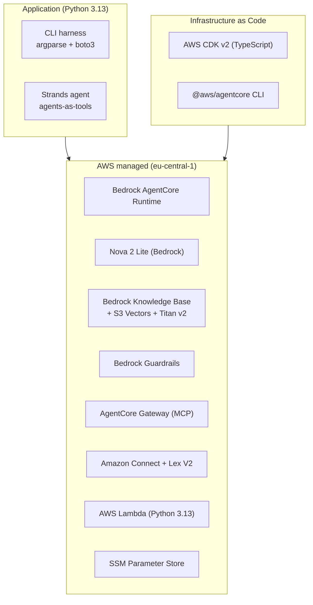

# Tech Stack

The stack is chosen for a regulated EU deployment: managed AWS services in one
region, a typed IaC layer, and a strict Python quality gate.

## Languages & runtimes

| Area | Choice | Why |
|------|--------|-----|
| Application & Lambdas | **Python 3.13+** | Team standard; Strands + Bedrock SDKs are Python-first |
| Infrastructure | **TypeScript (AWS CDK v2)** | Typed, testable IaC; project rule: TS *only* for CDK |
| Agent deploy | **`@aws/agentcore` CLI** | First-class AgentCore Runtime packaging & deploy |

## AI / agent layer

| Technology | Role |
|------------|------|
| **Amazon Bedrock AgentCore Runtime** | Hosts the deployed supervisor agent |
| **Strands Agents** | Agent framework; supervisor + specialists via the *agents-as-tools* pattern |
| **Amazon Nova 2 Lite** (`eu.amazon.nova-2-lite-v1:0`) | The model behind supervisor and specialists |
| **Bedrock Knowledge Base** | Managed RAG over the synthetic corpus |
| **S3 Vectors** | Vector storage for the KB |
| **Titan Embed v2** | Embedding model for ingestion & retrieval |
| **Bedrock Guardrails** | PII anonymization + investment-advice denial |
| **AgentCore Gateway** | Exposes the balance Lambda as an MCP tool (AWS_IAM / SigV4) |

## Channel layer

| Technology | Role |
|------------|------|
| **Amazon Connect** | Chat front door, contact flow, escalation queue |
| **Amazon Lex V2** | Used as a "dumb pipe" (FallbackIntent + dialog code hook) to capture free-text turns |
| **AWS Lambda** | Bridge (Lex ↔ AgentCore) and balance data function |

## Application & tooling

| Technology | Role |
|------------|------|
| **boto3** | AWS SDK for the CLI harness and Lambdas |
| **websocket-client** | Connect chat presence in `--connect` mode |
| **uv** | Python env & dependency management |
| **duty** (`scripts/make`) | Task runner (`setup`, `test`, `check`, `docs`, …) |
| **ruff** | Lint + format (`select = ALL`) |
| **ty** | Type checking |
| **pytest** | Tests (offline unit + gated live integration/eval) |
| **Jest** | CDK template tests |
| **zensical** | Documentation site (this site), with mermaid diagrams |

## Configuration & residency

- All resources in **`eu-central-1`**; runtime config in **SSM Parameter Store**
  under `/contact-center/*`.
- No secrets in the repo; no `.env` reads for credentials; AWS access via SSO
  profiles to the sandbox account only.

## Repository layout

| Path | Contents |
|------|----------|
| `src/contact_center/` | CLI harness (`chat`, `eval`) |
| `contactcenter/` | AgentCore project; supervisor + specialists in `app/knowledge_agent/` |
| `infra/` | Hand-written CDK: `KnowledgeStack`, `ConnectStack`, Lambdas, flow |
| `docs/corpus/` | Synthetic bank documents ingested by the KB |
| `docs/eval/` | Golden question set for the eval harness |
| `docs/` | This documentation site |
| `config/` | Tool configs (`ruff.toml`, `ty.toml`, `pytest.ini`, …) |
