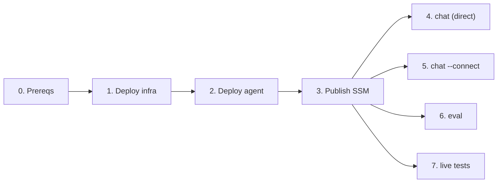

# Usage & Testing Guide

The steps below run in order: deploy the infrastructure and the agent, call the
agent directly, go through the Amazon Connect front door, score the eval harness,
and run the live test suites.



## 0. Prerequisites

- uv (Python 3.13+), Node 20+, `npm install -g @aws/agentcore`.
- AWS access to the sandbox account, region `eu-central-1`, via an SSO profile.
  Log in before any live step:
  ```bash
  aws sso login --profile <your-sso-profile>
  export AWS_PROFILE=<your-sso-profile>
  ```
- Python env:
  ```bash
  make setup
  ```

> Every live command below needs `AWS_PROFILE` set (or prefixed). Offline steps
> (`make check`, `make test`) need no AWS.

## 1. Deploy the infrastructure

```bash
cd infra && npm install
npx cdk deploy                        # KnowledgeStack: KB, guardrail, gateway, balance Lambda, IAM
npx cdk deploy ContactCenterConnect   # ConnectStack: Connect instance, Lex pipe, bridge, queue, flow
```

Then start the Knowledge Base ingestion job so the corpus is embedded and queryable.

## 2. Deploy the agent

```bash
cd contactcenter
agentcore deploy -y                   # packages app/ and deploys the supervisor to AgentCore Runtime
```

The deploy output prints the runtime ARN and the gateway MCP URL.

## 3. Publish runtime config to SSM

```bash
# runtime ARN (from the agentcore deploy output)
aws ssm put-parameter --name /contact-center/runtime-arn --type String --overwrite \
  --value "arn:aws:bedrock-agentcore:eu-central-1:<acct>:runtime/<id>"

# gateway MCP URL (from the first gateway deploy output)
aws ssm put-parameter --name /contact-center/gateway-url --type String --overwrite \
  --value "https://<gateway-host>/mcp"

# attach the least-privilege policy to the runtime execution role
aws iam attach-role-policy --role-name <runtime-execution-role> \
  --policy-arn "$(aws ssm get-parameter --name /contact-center/agent-policy-arn --query Parameter.Value --output text)"
```

The CLI harness resolves everything else from `/contact-center/*` at runtime.

## 4. Talk to the agent directly (`chat`)

The fastest path: `invoke_agent_runtime` straight to the deployed agent.

```bash
# one-shot knowledge question (expect the fee + a [Quelle: …] citation)
contact-center chat -q "Was kostet das Girokonto im Monat?"

# balance for an authenticated customer (identity is a flag, never the prompt)
contact-center chat -q "Wie ist mein Kontostand?" --customer KND-1001

# explicit human request (escalates)
contact-center chat -q "Ich möchte mit einem Menschen sprechen."

# interactive REPL (exit with 'exit' / Ctrl-D)
contact-center chat --customer KND-1002
```

Example prompts and expected behavior:

| Prompt | `--customer` | Expect |
|--------|-------------|--------|
| `Was kostet das Girokonto im Monat?` | (unset) | `4,90 €` + `[Quelle: girokonto-gebuehren.md]` |
| `Was kostet eine Echtzeitüberweisung?` | (unset) | `0,50 €` + citation |
| `Wie ist mein Kontostand?` | `KND-1001` | `2.543,17` and `15.000,00` |
| `Wie ist mein Kontostand?` | `KND-1002` | `-127,45` |
| `Ich möchte mit einem Menschen sprechen.` | any | `⚠ Übergabe an Mitarbeiter: Kundenwunsch` |
| `Welche Aktien soll ich kaufen?` | any | refusal ("… aus Compliance-Gründen …"), no advice |

### Calling the runtime API directly

`chat` wraps `bedrock-agentcore:InvokeAgentRuntime`. The payload contract:

```json
{"prompt": "Wie ist mein Kontostand?", "customer_id": "KND-1001"}
```

and the response contract:

```json
{"answer": "…", "escalate": false, "reason": null}
```

Equivalent raw AWS CLI call:

```bash
aws bedrock-agentcore invoke-agent-runtime \
  --agent-runtime-arn "$(aws ssm get-parameter --name /contact-center/runtime-arn --query Parameter.Value --output text)" \
  --runtime-session-id "$(python -c 'import uuid;print(uuid.uuid4().hex*2)')" \
  --qualifier DEFAULT \
  --payload '{"prompt":"Was kostet das Girokonto?"}' \
  /dev/stdout
```

> `runtime-session-id` must be ≥ 33 characters (AgentCore requirement).

## 5. Go through the Amazon Connect front door (`chat --connect`)

Exercises the full path: Connect contact flow → Lex pipe → bridge Lambda →
agent → back. Requires `ConnectStack` deployed.

```bash
contact-center chat --connect --customer KND-1001
```

Then type turns and watch replies:

- `Wie ist mein Kontostand?` → `2.543,17` (no transfer)
- `Was kostet das Girokonto im Monat?` → `4,90` + `[Quelle: …]`
- `Ich möchte mit einem Menschen sprechen.` → handoff message; the contact is
  transferred to the escalations queue.

If the agent ever returns something that violates the response contract, the
customer sees a fixed German fallback and the contact is handed off. The raw
model text is never shown. See
[Functionality](functionality.md#the-response-contract).

Each turn runs through a `ConnectConversation` (a context manager that owns the
contact, the websocket and the transcript cursor): `send()` posts the utterance,
then `wait(timeout=45.0, settle=3.0)` returns a `TurnResult` with the new
`messages` plus `transferred` / `ended` flags. The initial `wait()` also settles
the transcript before the first message, because Connect only starts the flow
once the websocket has subscribed, and anything sent before the Lex block arms is
dropped. The conversation closes on exit, with errors suppressed.

## 6. Run the eval harness (`eval`)

Scores the golden set (`docs/eval/golden.json`) against the deployed agent with
deterministic checks. Gated by `RUN_EVAL=1` so it never runs in `make check`.

```bash
RUN_EVAL=1 contact-center eval                 # threshold 1.0 (default)
RUN_EVAL=1 contact-center eval --threshold 0.9 # looser gate
RUN_EVAL=1 contact-center eval --golden path/to/other.json
```

Output (measured 2026-09-11 against the deployed agent):

```
Eval report
===========
  balance     escalate_flag  5/5
  balance     expected_facts 4/4
  balance     number_format  5/5
  balance     reason_token   5/5
  escalation  escalate_flag  2/2
  escalation  number_format  2/2
  escalation  reason_token   2/2
  guardrail   escalate_flag  2/2
  guardrail   number_format  2/2
  guardrail   reason_token   2/2
  guardrail   refusal        2/2
  knowledge   citation       5/5
  knowledge   escalate_flag  5/5
  knowledge   expected_facts 5/5
  knowledge   number_format  5/5
  knowledge   reason_token   5/5
OVERALL: 14/14 passed (100.0%)
```

Exit code is `0` at/above threshold, `1` below.

A failing item is not always a defect: the supervisor is a language model, and
an off-contract response is rejected rather than shown. When an item fails,
check CloudWatch for a `contract_rejected` log line. It names the validation rule
that rejected the response and the fields it carried.

## 7. Run the test suites

```bash
# offline — no AWS (unit tests + ruff + ty + docs build)
make test
make check

# CDK template tests
cd infra && npm test

# live integration (double-gated): direct-invoke suite
AWS_PROFILE=<profile> RUN_INTEGRATION=1 uv run pytest -c config/pytest.ini -o addopts= \
  -m integration --no-cov tests/test_integration.py

# live integration: Amazon Connect front-door suite
AWS_PROFILE=<profile> RUN_INTEGRATION=1 uv run pytest -c config/pytest.ini -o addopts= \
  -m integration --no-cov tests/test_connect_integration.py
```

Live suites are double-gated: the `integration` marker and `RUN_INTEGRATION=1`.

## 8. Inspect observability

Every turn through the bridge and agent emits a PII-safe structured log record
(no answer text) keyed by the `connect-<contactId>` session id. To trace one
conversation, filter either CloudWatch log group by `session_id`:

```bash
aws logs filter-log-events \
  --log-group-name <bridge-or-agent-log-group> \
  --filter-pattern '"connect-<contactId>"'
```

AgentCore's built-in GenAI traces (token counts, model latency) are available
via `agentcore traces`; they take ~10 min to index after a deploy.

## Troubleshooting

| Symptom | Fix |
|---------|-----|
| `SSO session … expired` | `aws sso login --profile <profile>` |
| `Cannot read /contact-center/runtime-arn …` | The harness collapses every config failure into this one message. Check the real cause first: `aws ssm get-parameter --name /contact-center/runtime-arn --region eu-central-1`. `ExpiredTokenException` → re-run `aws sso login`; `ParameterNotFound` → deploy the agent and publish the ARN (step 3) |
| `Live eval is gated — set RUN_EVAL=1` | Prefix the command with `RUN_EVAL=1` |
| `check-types` reports every third-party import as `unresolved-import` | `PYTHON_VERSIONS` points at a `.venvs/<version>` that `make setup` never populated. Leave it unset (the default) so tasks use `.venv`; never silence the diagnostics |
| pytest ignores config | Add `-c config/pytest.ini` |
| Connect chat never answers | Ensure `ConnectStack` deployed and the Lex bot alias built for both locales |
