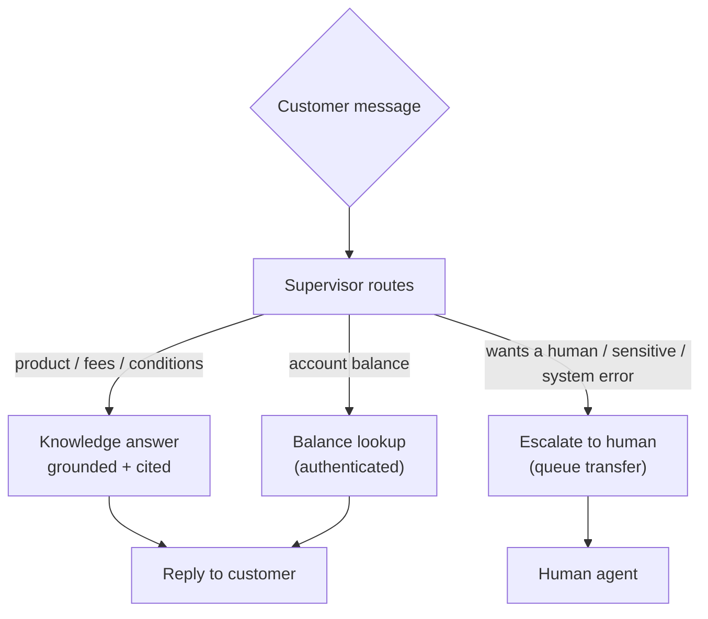

# Use Case

## The problem

The company runs a human-agent-heavy contact center: customers call or chat, and
staff answer product questions, look up account balances, and handle requests.
This is slow, expensive, and inconsistent, and it scales linearly with
headcount. The goal is to **modernize the front line into an agentic
assistant** that handles routine chat and voice interactions autonomously, with
a clean, auditable handover to a human whenever the assistant should not or
cannot proceed.

Because this is a **regulated German bank**, the solution operates under hard
constraints:

- **EU data residency** — everything runs in `eu-central-1`; no data leaves the
  region.
- **BaFin / DORA** — no unlicensed investment advice; PII is protected;
  operations must be observable and resilient.
- **Auditability** — answers must be grounded and cite their source; escalation
  must be a deterministic, traceable event.

## What the assistant does

- **Answer product questions** from a grounded knowledge base (fees, account
  conditions, transfers, card service, credit rules) — always with a citation.
- **Look up account balances** for the authenticated customer, formatted in
  German (`2.543,17 EUR`).
- **Escalate to a human** when the customer asks, when the topic is sensitive
  (e.g. credit-rejection detail), or when a backend fails — mapped to a real
  Amazon Connect queue transfer.
- **Refuse** what it must not do (investment advice) for compliance reasons.

## Design principles

- **Grounded, not generative-guessing.** Knowledge answers come from retrieval
  over a curated corpus and carry `[Quelle: …]` citations; the model does not
  invent product facts.
- **Deterministic contracts.** The agent returns a strict
  `{answer, escalate, reason}` contract; escalation reasons are fixed routing
  tokens, not free text.
- **Identity is never the LLM's decision.** The customer whose balance is read
  is bound server-side, not chosen by the model.
- **Fail toward a human.** Any failure in the pipe escalates to a person rather
  than dropping the customer.
- **Provable trust.** A deterministic eval harness scores answer quality on a
  golden set and gates on a pass-rate — the evidence a regulated deployment
  needs.

## Scope of this PoC

This is a **proof of concept**, deployed to a sandbox account with **synthetic**
data (three fake customers, a small synthetic corpus). It demonstrates the
architecture and the regulated-bank guarantees end to end over **chat**. Voice,
a hosted customer chat widget, a staffed-agent workspace, and cryptographic
customer identity (JWT/Cognito) are deliberately deferred.
