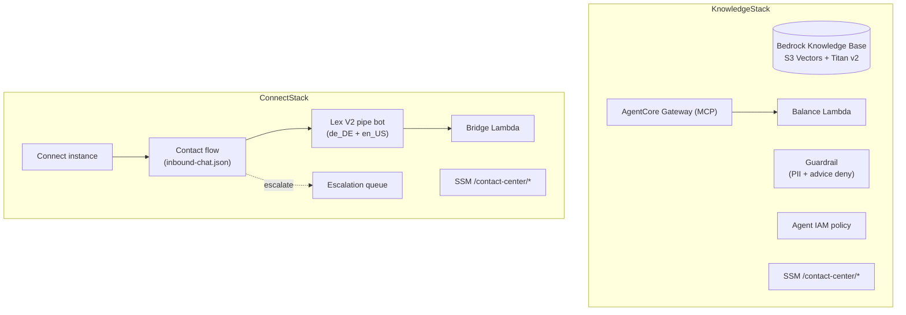

# infra — AWS CDK (TypeScript)

Hand-written AWS CDK v2 infrastructure for the contact-center PoC. Two stacks,
both in `eu-central-1`. This is **separate** from the AgentCore-generated CDK
under `contactcenter/agentcore/cdk/` — never merge the two.



## Stacks

### `KnowledgeStack` (`lib/knowledge-stack.ts`)
Provisions the RAG + banking backbone:

- **Bedrock Knowledge Base** over `docs/corpus/`, **S3 Vectors** storage,
  **Titan Embed v2** embeddings.
- **Guardrail** — PII anonymization + investment-advice denial.
- **AgentCore Gateway** target for the **balance Lambda** (`lambda/balance/`),
  exposed as an MCP tool with AWS_IAM auth.
- **IAM** — least-privilege managed policy for the agent runtime role.
- **SSM** parameters under `/contact-center/*` (KB id, guardrail id/version,
  gateway URL, agent policy ARN, …).

### `ConnectStack` (`lib/connect-stack.ts`)
Provisions the Amazon Connect chat front door (M3):

- **Connect instance** + **escalation queue** + routing profile + hours.
- **Lex V2 "pipe" bot** — FallbackIntent-only with a dialog code hook; built for
  **both `de_DE` and `en_US`** locales (Connect invokes Lex with the contact's
  default `en_US`, while customers write German). A `Noop` intent exists only so
  each locale builds.
- **Bridge Lambda** (`lambda/bridge/`) — the Lex dialog code hook; forwards each
  turn to the AgentCore runtime and maps the response contract back to Lex
  (ElicitIntent to loop, Close to escalate). It **never raises** and fails
  toward a human.
- **Contact flow** (`lib/flows/inbound-chat.json`) — greeting → Lex input →
  escalation check → queue transfer.
- **SSM** parameters (instance id, contact-flow id, escalation-queue arn,
  lex-alias arn).

## Lambdas

| Path | Role |
|------|------|
| `lambda/balance/handler.py` | Synthetic account data (KND-1001/1002/1003) behind the Gateway |
| `lambda/bridge/handler.py` | Lex ↔ AgentCore bridge; PII-safe structured logging; never raises |

## Commands

```bash
npm install
npx cdk deploy                       # KnowledgeStack
npx cdk deploy ContactCenterConnect  # ConnectStack
npm test                             # Jest template tests
```

Deploy to the **sandbox account only**, region `eu-central-1`.

## Gotchas

- The Lambda ARN inlined in `contactcenter/agentcore/agentcore.json` embeds the
  CloudFormation logical-id suffix — recreating `KnowledgeStack` strands the
  gateway target; re-inline the new ARN after any stack recreation.
- `CfnBotVersion` snapshots need a logical-id rotation (V2 → V3 …) to repoint the
  alias whenever the bot definition changes.
- The contact flow uses content language `2019-10-30`; validate edits with
  `aws connect update-contact-flow-content --cli-error-format json`.
