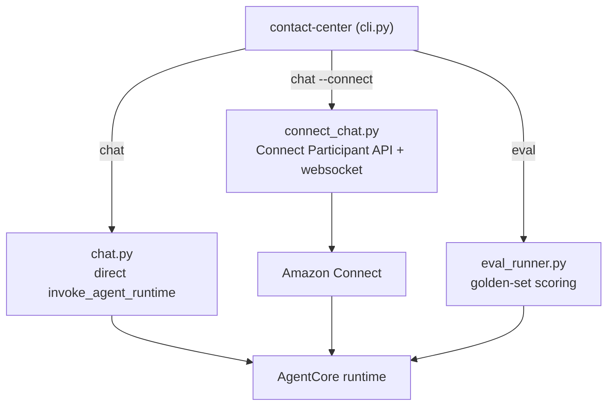

# src/contact_center — CLI harness

The `contact-center` command-line harness: the operator/test front end to the
deployed agent. Public API (`__init__.py`): `get_parser`, `main`.



## Subcommands

| Command | Module | What it does |
|---------|--------|--------------|
| `chat` | `_internal/chat.py` | Direct `invoke_agent_runtime` to the deployed agent (one-shot `-q` or REPL); `--customer` sets the authenticated id |
| `chat --connect` | `_internal/connect_chat.py` | Drives a real Amazon Connect chat contact (Participant API + websocket presence), exercising the full front door |
| `eval` | `_internal/eval_runner.py` | Scores the golden set against the deployed agent with deterministic checks; `RUN_EVAL=1` gated |

## Modules

| File | Responsibility |
|------|----------------|
| `_internal/cli.py` | Argument parser + dispatch (`get_parser`, `main`) |
| `_internal/chat.py` | `ask()` (invoke → response contract), `render()`, `run_chat()` |
| `_internal/connect_chat.py` | Connect chat session lifecycle, transcript polling, settle-draining |
| `_internal/eval_runner.py` | Golden-set model, deterministic scorer, report, orchestrator |
| `_internal/aws.py` | SSM parameter names + `get_parameter`; region constant |
| `_internal/debug.py` | `--debug-info` / version helpers |

## Usage

```bash
contact-center chat -q "Was kostet das Girokonto?"      # direct, one-shot
contact-center chat --connect --customer KND-1001        # through Amazon Connect
RUN_EVAL=1 contact-center eval --threshold 1.0           # score the golden set
```

## Conventions

- **Absolute imports only** (`from contact_center._internal import …`).
- Config comes from **SSM** (`/contact-center/*`), resolved at runtime; missing
  required parameters fail closed with a named remediation message.
- Keep `__init__.py` `__all__` (`get_parser`, `main`) in sync with what tests
  import.
